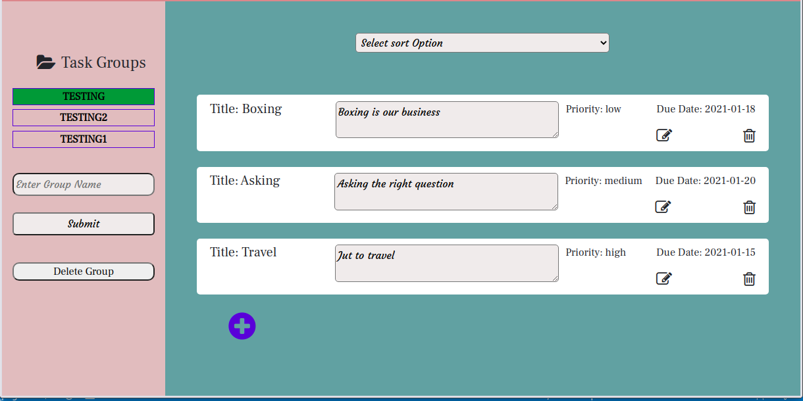

# My To-do List App

This is an application that helps users to organize and manage their tasks. Users can create a new task group and can also delete it if needed. Various tasks can be created within a particular task group. This can be initiated by clicking on the rounded plus icon on the task display page to call up the required form. The title of the task, description, expected task completion date, and task priority must be included during task creation. Each task can be edited or deleted if necessary. Double click on a completed task to highlight it. Tasks can also be sorted according to due-date and priority. For this project, JavaScript local storage is used to store the data on a user's computer. The implementation scripts are arranged in three different files placed in the modules folder. The file domVariables.js contain all variable definition for DOM manipulation. The files addGroupName.js and manageTasks.js contain the application logic performing different operations and functions of each file. All the DOM manipulations are contained in the index.js file for clarity. This application is fully responsive and can be viewed on various mobile devices.

## Preview

## Home Page, Desktop view


## Task Display, Desktop view


## Mobile view One


## Mobile view Two


## Mobile view Three


## Features 

- Users can create a task group.
- User can delete the task group. 
- User can create tasks for a selected group.
- Each task can be edited and deleted
- Group tasks can be sorted by due-date and priority
- The completed task can be highlighted
- Webpack compiles ES6 JavaScript code

## Project SetUp

Get a local copy of the file. Clone with HTTPS using the command below.

```
git clone https://github.com/Zubenna/my-todo-list-app.git
```
## Access project folders 
```
cd my-todo-list-app, then, cd dist.
```
- Click on index.html to display the application on the browser.
- Text all application features.

## Testing With Jest
The folder, test, contains all the tests written for this project. Functions in the addGroupName.js and manageTasks.js are mocked and tested using two different test files. The testing framework used is Jest. About 20 different tests have been written for this project by mocking the actual implementation. You can run the test at the root of the project by opening the command prompt and typing the command below:
```
 npm run test
``` 
## Live Version
- [Launch App](https://zubenna.github.io/my-todo-list-app/)

## Built With
- JavaScript
- Webpack
- HTML
- CSS
- Bootstrap 4
- Jest for testing

## Author

👤 **Nnamdi Emelu**
- Github: [@zubenna](https://github.com/zubenna)
- Twitter: [@zubenna](https://twitter.com/zubenna)
- Linkedin: [nnamdi-emelu](https://www.linkedin.com/in/nnamdi-emelu/)

##  Contributing

Contributions, issues, and feature requests are welcome!

Feel free to check the [issues page](https://github.com/Zubenna/my-todo-list-app/issues)

## Show your support

Give a star if you like this project!

## Acknowledgments
- Project originally taken from The Odin Project
- Project inspired by Microverse Program